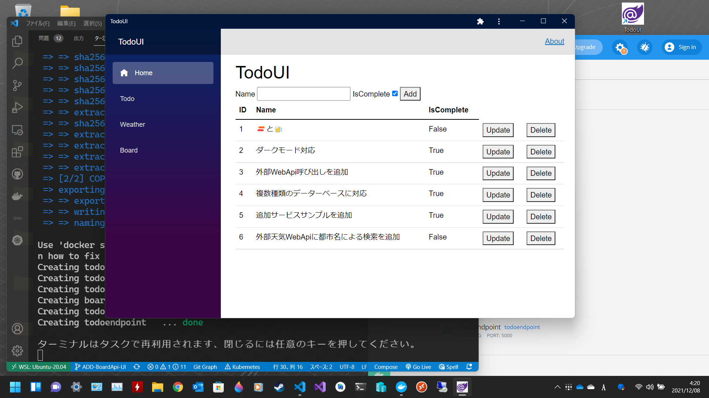

# TodoApp For Microservices

This project is a todo application that uses a microservice architecture.

It was created for learning microservice architecture.


## Structure

|     Name     |   Type   | Languages | Environment |   OS   |          Framework           | Description                                          | Dependences |
| :----------: | :------: | :-------: | :---------: | :----: | :--------------------------: | ---------------------------------------------------- | :---------: |
|   TodoApi    |  WebAPI  |    C#     |   .NET 6    | alpine |    ASP.NET Core 6 WebAPI     | CRUD WebAPI For Todo. Requirements MariaDB or MySQL. |   TodoDB    |
|    TodoUI    |  WebUI   |    C#     |   .NET 6    | alpine | ASP.NET Core 6 Blazor Server | WebUI For TodoApi. PWA Support (except offline)      |   TodoApi   |
| TodoEndpoint | Endpoint |   ----    |    Nginx    | alpine |             ----             | Nginx Reverse Proxy/TodoApp Endpoint.                |   TodoUI    |
|    TodoDB    |    DB    |   ----    |   MariaDB   | ubuntu |             ----             | DB For TodoApi.                                      |    ----     |

### Access Flow

TodoEndpoint -> TodoUI -> TodoApi -> TodoDB

## Deployment

### Docker

Requirements

- Docker
- Docker Compose (If you have less than Compose V2, use the `docker-compose` command instead of the `docker compose` command.)

```bash
git clone git@github.com:Yutaro-B18016/TodoApp-For-Microservices.git

cd TodoApp-For-Microservices/deploy/compose

docker compose up -d --build
```

After deployment, it can be accessed on `localhost:5000`.

You can use Adminer on `localhost:8080` to access the DB.(The default is tododb for Server, todoapi for user, toadoapi for password, and todoapi for database.)

### Kubernetes

Requirements

- kubectl (Able to manipulate target Kubernetes)
- Docker
- skaffold

```bash
git clone git@github.com:Yutaro-B18016/TodoApp-For-Microservices.git

cd TodoApp-For-Microservices/

SKAFFOLD_DEFAULT_REPO=$DOCKER_REGISTRY skaffold -n $DEPLOY_NAMESPACE run
```

**$DOCKER_REGISTRY needs to be changed to your Docker Registry, and $DEPLOY_NAMESPACE to your deploy namespace.**

If you use the default namespace, `-n $DEPLOY_NAMESPACE` is optional.

If you are using a local Docker Registry such as Minikube, `SKAFFOLD_DEFAULT_REPO=$DOCKER_REGISTRY` is not necessary.

After deployment, it can be accessed on `Node IP:31000` using the node port.

The data in the DB is not persistent.

#### Sample NS/SC/PV/PVC (Use the sample to make the data persistent.)

The sample PV uses Node local.(It is not possible to increase the value of `replicas` in the database.)

**The node-name in [Todo-SC.yml](./deploy/k8s/Todo-SC.yml) needs to be changed to your node name.**

```bash
git clone git@github.com:Yutaro-B18016/TodoApp-For-Microservices.git

cd TodoApp-For-Microservices/deploy/k8s/

kubectl apply -f Todo-NS.yml

sudo mkdir -p /mnt/kubernetes/tododb

sudo chmod 777 /mnt/kubernetes/tododb

kubectl apply -f Todo-SC.yml

cd ../../

SKAFFOLD_DEFAULT_REPO=$DOCKER_REGISTRY skaffold -n todoapp run

cd ./deploy/k8s/

kubectl apply -n todoapp -f TodoDB-PVC.yml
```

#### Access using Ingress

**The default Ingress Controller is required.**

After deploying the app, do the following.

```bash
git clone git@github.com:Yutaro-B18016/TodoApp-For-Microservices.git

cd TodoApp-For-Microservices/deploy/k8s/

kubectl apply -n $DEPLOY_NAMESPACE -f Tododb-Ingress.yml
```

After deployment, it can be accessed by Ingress.

#### Accessing the DB using Adminer

```bash
git clone git@github.com:Yutaro-B18016/TodoApp-For-Microservices.git

cd TodoApp-For-Microservices/deploy/k8s/

kubectl apply -n $DEPLOY_NAMESPACE -f Tododb-Console.yml
```

After deployment, it can be accessed on `Node IP:31880` using the node port.(The default is tododb for Server, todoapi for user, toadoapi for password, and todoapi for database.)

## Development

Requirements

- Docker
- Docker Compose
- Visual Studio Code
- Remote - Containers(VSCode Extentions)
- Docker (VSCode Extentions)



### TodoApi/TodoUI

Open the [TodoApi](./TodoApi/)/[TodoUI](./TodoUI) directory in VSCode.

After opening, select `Reopen in Container` in the notification at the bottom right.